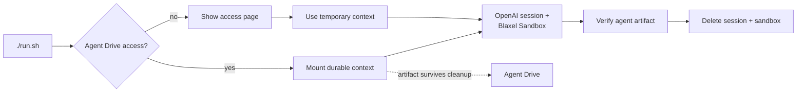

# OpenAI Agents API on Blaxel

Run an OpenAI-hosted agent on a self-hosted Codex executor in a Blaxel Sandbox. Agent Drive keeps the input and generated artifact after the temporary session and sandbox are gone.



## Prompt your agent

Copy this prompt into any coding agent with terminal access:

```text
Clone https://github.com/blaxel-ai/openai-agents-api-cookbook.git and run the example end to end.

1. Read AGENTS.md first, then follow README.md.
2. Prepare Blaxel. The run requires `BL_WORKSPACE` and `BL_API_KEY`; reuse them when present and check presence only. Use `bl version` and `bl workspaces` to verify the CLI and intended workspace. If needed, install the CLI from https://docs.blaxel.ai/cli-reference/introduction, then run `bl login <workspace>` and wait for me to finish browser login. If this agent supports skills, use installed `blaxel-cli` or `blaxel-sdk` skills for setup guidance; ask before installing missing global skills. CLI login helps with setup but does not replace the two required environment variables. Never print or save a secret.
3. Prepare OpenAI. Make sure `OPENAI_API_KEY` is available without printing it and belongs to the OpenAI project you want to use. No extra OpenAI skills are required. Confirm Git can read the Agents API SDK source pinned by this checkout through existing credentials. If it cannot, report that packaging-access blocker and stop; never ask me to paste a GitHub token into chat. If OpenAI setup needs the web, use Computer Use in Codex or Claude Code's Chrome integration when available to open the official account, project, or API key page. Pause for me at sign-in, MFA, or secret entry, and ask before creating a key or changing access. Never print, paste into chat, or save a secret.
4. Check for Python 3.11-3.14 and Git. If either is missing, tell me exactly what is needed and how to install it.
5. Run ./run.sh with the default Agent Drive auto mode. Do not change source files, commit, push, or open a PR.
6. Confirm that the OpenAI session and Blaxel Sandbox were created, the agent artifact was verified, the final status was idle, and both temporary resources were deleted. If Agent Drive is unavailable, include the exact access-request URL and confirm that the temporary fallback completed.
7. Finish with the artifact path, whether it persisted on Agent Drive, and any action I still need to take.
```

## Run it yourself

You need Python 3.11–3.14, Git, the [Blaxel CLI](https://docs.blaxel.ai/cli-reference/introduction) logged into your workspace, an OpenAI API key, and a Blaxel API key. This development checkout currently installs its pinned Agents API client from OpenAI's access-controlled source, so Git must already be able to read it.

```bash
git clone https://github.com/blaxel-ai/openai-agents-api-cookbook.git
cd openai-agents-api-cookbook

bl version
bl workspaces

export OPENAI_API_KEY='<openai-project-key>'
export BL_WORKSPACE='<blaxel-workspace>'
export BL_API_KEY='<blaxel-api-key>'

./run.sh
```

The script keeps credentials in the process environment. It does not write them to `.env` or Git config. CLI login helps identify and authenticate the workspace, but `BL_WORKSPACE` and `BL_API_KEY` remain explicit runtime inputs.

## What you get

With Agent Drive access:

```text
Agent Drive: using openai-agents-api-context
started Blaxel sandbox ...
created OpenAI session ...
environment connected
final status: idle
verified agent artifact ...
kept durable result on Agent Drive ...
deleted OpenAI session
deleted Blaxel sandbox
```

The input and generated `summary.md` remain under a unique `runs/<id>/` folder on Agent Drive. A later sandbox or independent agent session can mount the same drive and reuse that context.

Without Agent Drive access:

```text
Agent Drive: Agent Drive is not enabled for workspace '...'
Request access: https://app.blaxel.ai/.../global-agentic-network/drives
Continuing with disposable sandbox context.
```

The task still completes. The printed Console page shows the Agent Drive access request for the signed-in workspace.

## Agent Drive policy

`BL_AGENT_DRIVE_MODE` controls the fallback:

| Value | Behavior |
| --- | --- |
| `auto` | Use Agent Drive when available; otherwise show the access page and continue with temporary storage |
| `required` | Stop with the access page if durable context is unavailable |
| `off` | Run with temporary sandbox storage |

`auto` is the default. Agent Drive private preview currently requires `us-was-1`; another `BL_REGION` falls back in `auto` mode and fails clearly in `required` mode.

The reusable drive defaults to `openai-agents-api-context`. Set `BL_AGENT_DRIVE_NAME` to choose another lowercase resource name.

## The starter boundary

Keep:

- OpenAI session and environment connection
- Blaxel Sandbox and Codex executor lifecycle
- Agent Drive entitlement handling, scoped mount, and durable run folders
- event streaming, deterministic verification, diagnostics, and cleanup

Replace:

- `sample_report.txt`
- the agent instructions and prompt in `main.py`
- the artifact schema and verification rule

Extend with another session, job, or agent that mounts the same drive when you need cross-agent handoffs. Agent Drive shares files and artifacts; it does not merge model memory or OpenAI conversation history.

## Defaults

| Setting | Value |
| --- | --- |
| Model | `gpt-5.6` |
| Region | `us-was-1` |
| OpenAI Agents API SDK | `0.1.1` |
| Blaxel Python SDK | `0.3.2` |
| Codex executor | `0.146.0-alpha.3` |
| Sandbox lifetime | 15 minutes |

Override the model and region with `OPENAI_MODEL` and `BL_REGION`. Refresh the SDK, model, and executor pins together.

## Files

| Path | Purpose |
| --- | --- |
| `main.py` | readable end-to-end recipe and artifact verification |
| `context_store.py` | Agent Drive access, scoped durable context, and fallback |
| `runtime.py` | Codex executor, event streaming, diagnostics, and cleanup |
| `run.sh` | access preflight and one-command setup |
| `sample_report.txt` | replaceable sample input |
| `tests/` | lifecycle, access, fallback, verification, and cleanup contracts |
| `AGENTS.md` | instructions for coding agents |
| `CLAUDE.md` | Claude Code pointer to `AGENTS.md` |

## Verify changes

```bash
.venv/bin/python -m pytest
.venv/bin/ruff check .
.venv/bin/python -m compileall -q main.py context_store.py runtime.py tests
bash -n run.sh
```

`./run.sh` is the live integration test. It creates hosted resources and invokes a model.

## Links

- [Agent Drive overview and access request](https://docs.blaxel.ai/Agent-drive/Overview)
- [Blaxel Sandboxes](https://docs.blaxel.ai/Sandboxes/Overview)
- [Blaxel API keys](https://docs.blaxel.ai/Security/Access-tokens#api-keys)
- [Blaxel Python SDK](https://github.com/blaxel-ai/sdk-python)
- [OpenAI API keys](https://platform.openai.com/api-keys)
