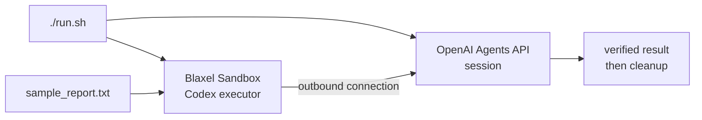

# OpenAI Agents API on Blaxel

Run a hosted OpenAI agent against a self-hosted Codex executor in a disposable Blaxel Sandbox.

> This uses the private-preview OpenAI Agents API, not the public OpenAI Agents SDK.



## Quick start

You need Python 3.11–3.14, Git, preview-enabled OpenAI credentials, a Blaxel API key, and access to the private [Agents API Python preview](https://github.com/OpenAI-Early-Access/agents-api-python-preview).

```bash
git clone https://github.com/blaxel-ai/openai-agents-api-cookbook.git
cd openai-agents-api-cookbook

export OPENAI_API_KEY='<openai-project-key>'
export BL_WORKSPACE='<blaxel-workspace>'
export BL_API_KEY='<blaxel-api-key>'

# Only needed when your Git credential helper cannot read the preview SDK:
export GITHUB_TOKEN='<github-token>'

./run.sh
```

Credentials stay in the process environment. The script does not persist them to `.env` or Git config.

## A successful run

```text
created OpenAI session ...
started Blaxel sandbox ...
environment connected
final status: idle
verified workspace file read
deleted OpenAI session
deleted Blaxel sandbox
```

The file-read marker matters: `idle` proves the turn ended, not that the agent completed the task.

## What happens

| Step | Owner | Action |
| --- | --- | --- |
| 1 | `run.sh` | Checks access and installs the pinned dependencies |
| 2 | OpenAI | Creates one hosted agent session |
| 3 | Blaxel | Creates one sandbox and starts `codex exec-server` |
| 4 | Agent | Reads `/workspace/sample_report.txt` and returns its marker |
| 5 | `main.py` | Verifies the marker and deletes both resources |

No inbound sandbox port is opened.

## Defaults

| Setting | Value |
| --- | --- |
| Model | `gpt-5.6` |
| Region | `us-was-1` |
| OpenAI preview SDK | `0.1.1` at `cced8d0` |
| Blaxel Python SDK | `0.3.2` |
| Codex executor | `0.146.0-alpha.3` |

Override the first two with `OPENAI_MODEL` and `BL_REGION`. Refresh the SDK, model, and executor pins together.

## Develop

```bash
.venv/bin/python -m pytest
.venv/bin/ruff check .
.venv/bin/python -m compileall -q main.py tests
bash -n run.sh
```

`./run.sh` is the live integration test: it creates hosted resources and invokes a model.

## If it fails

| Symptom | Check |
| --- | --- |
| Missing OpenAI or Blaxel variable | Export the three required keys shown above |
| Preview SDK cannot be read | Export a `GITHUB_TOKEN` with read access |
| Agents API access error | Confirm the OpenAI project has preview access |
| Executor never connects | Check outbound access to `api.openai.com` and `registry.npmjs.org` |
| Marker verification fails | The environment connected, but the agent did not prove it read the file |

Cleanup is attempted on every handled failure. The sandbox's 15-minute lifetime is only a backstop.

## Files

| Path | Purpose |
| --- | --- |
| `main.py` | Complete session, sandbox, executor, verification, and cleanup flow |
| `run.sh` | Access preflight and one-command setup |
| `sample_report.txt` | File and marker read by the hosted agent |
| `tests/test_main.py` | Local contract and failure-path tests |
| `AGENTS.md` | Instructions for coding agents |
| `CLAUDE.md` | Claude Code pointer to `AGENTS.md` |

This first example intentionally stops at one session, one sandbox, and one file task. Agent Drive, persistence, webhooks, and multi-session orchestration come later.

## Links

- [Blaxel Sandboxes](https://docs.blaxel.ai/Sandboxes/Overview)
- [Blaxel API keys](https://docs.blaxel.ai/Security/Access-tokens#api-keys)
- [Blaxel Python SDK](https://github.com/blaxel-ai/sdk-python)
- [OpenAI Agents API Python preview](https://github.com/OpenAI-Early-Access/agents-api-python-preview)
