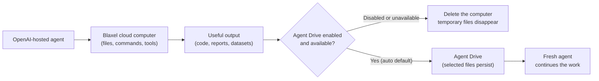

# OpenAI Agents API on Blaxel

Use this starter when an AI agent needs to run commands, work with files, or create deliverables, but you do not want it operating on your laptop or production server.

This repo connects an OpenAI-hosted agent to a disposable Blaxel cloud computer. Agent Drive can keep selected files after that computer is deleted, so a fresh agent can continue the work later.



## Prompt your agent

Copy this into a coding agent with terminal access:

```text
Clone https://github.com/blaxel-ai/blaxel-openai-agents-api-cookbook.git and read AGENTS.md.

Without printing or saving secrets, confirm that OPENAI_API_KEY, BL_WORKSPACE, and BL_API_KEY are available and that the pinned Agents API client can be installed.

Run ./run.sh --handoff without changing source files. Report where summary.md and review.md were created, whether their contents were confirmed, and whether both temporary OpenAI sessions and Blaxel cloud computers were deleted.

If setup or access blocks the run, stop and report the exact missing requirement or access page.
```

## Run it yourself

You need Python 3.11–3.14, Git, an OpenAI API key with Agents API access, and a Blaxel workspace and API key. `run.sh` creates the virtualenv and installs the Agents API client version pinned in [`pyproject.toml`](pyproject.toml).

```bash
git clone https://github.com/blaxel-ai/blaxel-openai-agents-api-cookbook.git
cd blaxel-openai-agents-api-cookbook

export OPENAI_API_KEY='<openai-project-key>'
export BL_WORKSPACE='<blaxel-workspace>'
export BL_API_KEY='<blaxel-api-key>'

./run.sh
```

The baseline run:

1. Starts one Blaxel cloud computer.
2. Connects one OpenAI-hosted agent to it.
3. Gives the agent a source file and asks for `summary.md`.
4. Reads `summary.md` back and confirms it contains a marker from the source.
5. Deletes the OpenAI session and cloud computer.

Run the optional Agent Drive handoff to show a fresh agent continuing from the saved file:

```bash
./run.sh --handoff
```

The handoff deletes the first session and computer before starting a fresh pair. The fresh agent reads the saved `summary.md`, creates `review.md`, confirms both files, and then deletes the second temporary pair.

## What success looks like

```text
Agent Drive: using openai-agents-api-context
started Blaxel sandbox ...
created OpenAI session ...
environment connected
final status: idle
confirmed generated file .../summary.md
kept durable result on Agent Drive openai-agents-api-context:/openai-agents-api-cookbook/runs/<id>/summary.md
deleted OpenAI session
deleted Blaxel sandbox

started Blaxel sandbox ...
confirmed saved source .../summary.md
created handoff OpenAI session ...
environment connected
final handoff status: idle
confirmed review file .../review.md
kept handoff result on Agent Drive openai-agents-api-context:/openai-agents-api-cookbook/runs/<id>/review.md
deleted OpenAI session
deleted Blaxel sandbox
```

The first agent must copy an exact marker from `sample_report.txt` into both its response and `summary.md`. The fresh agent must read that saved file and copy the original marker into `review.md` with a second marker. This proves the agents used the files instead of producing an ungrounded answer.

Both computers and OpenAI sessions are temporary. When Agent Drive is enabled, only the files remain under one unique `runs/<id>/` folder.

## If Agent Drive is not enabled

If the workspace does not have Agent Drive access, the default run still works with temporary sandbox storage and prints the exact Blaxel Console page where the signed-in workspace can request access.

| Mode | What happens |
| --- | --- |
| `auto` | Use Agent Drive when available; otherwise show the access page and continue with temporary storage |
| `required` | Stop with the access page when durable files are unavailable |
| `off` | Always use temporary sandbox storage |

`auto` is the default. Set the mode before running:

```bash
export BL_AGENT_DRIVE_MODE=off
./run.sh
```

Agent Drive currently uses `us-was-1`. A different `BL_REGION` explains the mismatch and falls back to temporary storage in `auto` mode without showing the access page.

The fresh-session handoff requires Agent Drive, so `./run.sh --handoff` treats `auto` as required and refuses `BL_AGENT_DRIVE_MODE=off`. Authentication, mount, configuration, and other platform failures also stop instead of silently falling back.

## Make it yours

Start with the pieces that are specific to the demo:

| Change | Where |
| --- | --- |
| Input file | `sample_report.txt` |
| Agent instructions and task | `main.py` |
| Output file and confirmation rule | `main.py` |
| Fresh-agent follow-up | `handoff.py` |

Keep the lifecycle and safety pieces:

- OpenAI session and self-hosted environment connection
- Blaxel Sandbox creation and cleanup
- Agent Drive access handling and scoped folders
- event streaming, deterministic confirmation, and failure diagnostics

Agent Drive shares files. It does not merge model memory or OpenAI conversation history.

## What's next

Each idea below is a prompt for a coding agent that has this repository cloned and the same environment variables set. All three were run end to end from this repository before being written down.

### 1. Swap in your own document (2 minutes)

```text
Replace the contents of sample_report.txt with a document of mine, keeping the exact
"Verification marker:" line from the original file. Run ./run.sh and confirm the run
prints "confirmed generated file" and that the kept summary.md reflects my document
instead of the original sample.
```

### 2. Analyze data and open the result in your browser

The repository ships [`sample_data.csv`](sample_data.csv) (14 days of session counts) so this works out of the box. Point it at your own CSV afterwards.

```text
Create analyze.py, a copy of main.py where the agent reads sample_data.csv instead of
sample_report.txt, computes total sessions, total errors, and the busiest date (keep
date strings exactly as they appear in the CSV), and writes report.html: a fully
self-contained HTML page with those numbers, an inline SVG bar chart of sessions per
date, and the verification marker in an HTML comment. After confirming the marker and
the totals in the file, serve the run directory from inside the sandbox on port 4321
(bind to the HOST environment variable; the sandbox image already occupies port 8080
and has no curl), create a public Blaxel preview URL for that port, print the URL,
and keep the sandbox alive until I confirm I opened it.
```

### 3. Run it as a hosted Blaxel job, with no laptop in the loop

```text
Deploy this orchestration as a Blaxel job. Scaffold with "bl new job" (Python), copy
main.py, context_store.py, runtime.py, and sample_report.txt into src/, vendor the
agent_api_sdk package directory into src/ (the pinned client is not on PyPI), and add
a wrapper entrypoint that calls run_report() through bl_start_job. Three hosted
specifics: the only secret the job needs in its .env is OPENAI_API_KEY, because
Blaxel injects workspace credentials, so return a placeholder from the wrapper for
the BL_API_KEY requirement instead of demanding the variable; set
os.environ["BL_REGION"] = "us-was-1" in the wrapper before importing the cookbook
modules, because the platform injects the job's own region and Agent Drive requires
us-was-1; and depend on blaxel==0.4.0, which caps mcp below 2. Deploy with "bl deploy",
start one execution with a single empty task, confirm the job logs print "kept
durable result on Agent Drive", then remove the job with "bl delete job".
```

<details>
<summary>Configuration and repository map</summary>

### Defaults

| Setting | Value |
| --- | --- |
| Model | `gpt-5.6` |
| Region | `us-was-1` |
| OpenAI Agents API SDK | `0.1.1` |
| Blaxel Python SDK | `0.4.0` |
| Codex executor | `0.146.0-alpha.3` |
| Sandbox lifetime | 15 minutes |

Override the model and region with `OPENAI_MODEL` and `BL_REGION`. Set `BL_AGENT_DRIVE_NAME` to choose another reusable Drive.

### Files

| Path | Purpose |
| --- | --- |
| `main.py` | readable end-to-end recipe |
| `handoff.py` | fresh agent and computer continue from the saved file |
| `context_store.py` | Agent Drive access, scoped storage, and fallback |
| `runtime.py` | Codex executor, event streaming, diagnostics, and cleanup |
| `run.sh` | access preflight and one-command setup |
| `sample_report.txt` | replaceable sample input |
| `tests/` | lifecycle, access, confirmation, and cleanup checks |
| `AGENTS.md` | instructions for coding agents |
| `CLAUDE.md` | Claude Code pointer to `AGENTS.md` |

</details>

## Verify changes

```bash
.venv/bin/python -m pytest
.venv/bin/ruff check .
.venv/bin/python -m compileall -q main.py handoff.py context_store.py runtime.py tests
bash -n run.sh
```

`./run.sh` and `./run.sh --handoff` create hosted resources and invoke a model.

## Links

- [Agent Drive overview and access request](https://docs.blaxel.ai/Agent-drive/Overview)
- [Blaxel Sandboxes](https://docs.blaxel.ai/Sandboxes/Overview)
- [Blaxel API keys](https://docs.blaxel.ai/Security/Access-tokens#api-keys)
- [Blaxel Python SDK](https://github.com/blaxel-ai/sdk-python)
- [OpenAI API keys](https://platform.openai.com/api-keys)
