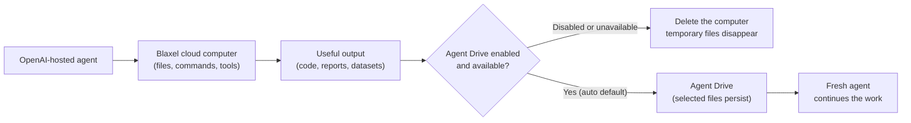
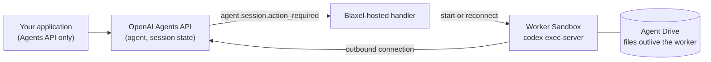

# OpenAI Agents API on Blaxel

Build agent features into your own product with a managed OpenAI agent backend. Your application submits work through the Agents API; OpenAI manages agent sessions and execution. This starter connects those agents to isolated Blaxel computers so they can run commands, work with files and create deliverables.

Blaxel supplies the compute, and Agent Drive keeps selected files after a computer is deleted. Your application still defines the experience, tool access and provisioning policy. The benefit is separating the managed agent service from the computers and files it uses.
Agent Drive also gives an agent team a shared workspace: two specialists can work in parallel on separate computers, save their findings, and let a coordinator combine those files into one result. The [team example](examples/openai_agent_drive.py) demonstrates this with an engineering recovery plan and customer outreach plan.



## Prompt your agent

Copy this into a coding agent with terminal access:

```text
Clone https://github.com/blaxel-ai/blaxel-openai-agents-api-cookbook.git and read AGENTS.md.

Without printing or saving secrets, confirm that OPENAI_API_KEY is available, that Blaxel credentials are available (a `bl login` session, or BL_WORKSPACE and BL_API_KEY), and that the Agents API client in pyproject.toml can be installed. Tell me if OPENAI_EXECUTOR_API_KEY is missing, but continue.

Run ./run.sh --handoff without changing source files. Report where summary.md and review.md were created, whether their contents were confirmed, and whether both temporary OpenAI sessions and Blaxel cloud computers were deleted.

If setup or access blocks the run, stop and report the exact missing requirement or access page.
```

## Run it yourself

You need Python 3.11–3.14, Git, an OpenAI API key with Agents API access, and a Blaxel workspace. `run.sh` creates the virtualenv and refreshes the dependencies from [`pyproject.toml`](pyproject.toml).

```bash
git clone https://github.com/blaxel-ai/blaxel-openai-agents-api-cookbook.git
cd blaxel-openai-agents-api-cookbook

export OPENAI_API_KEY='<openai-project-key>'
export OPENAI_EXECUTOR_API_KEY='<restricted-openai-key>'   # recommended, see Keys
bl login                                                  # or export BL_WORKSPACE and BL_API_KEY

./run.sh
```

### Keys

Two OpenAI keys keep the project key out of the agent's computer. `OPENAI_API_KEY` stays on your machine and creates sessions. `OPENAI_EXECUTOR_API_KEY` is the only key that enters the Blaxel Sandbox, where the Codex executor uses it to register with the session. Create it at [platform.openai.com/api-keys](https://platform.openai.com/api-keys) as a restricted key in the same project and owner as `OPENAI_API_KEY`, with the executor connection permission required by your project. When strict executor permissions are enabled, the key needs `api.agents.environments.connect`; **List models: Read** alone is insufficient. Ask your OpenAI representative if that permission is unavailable in your key settings. Without it, the cookbook warns and uses the project key inside the Sandbox.

Blaxel credentials come from `bl login` ([install the CLI](https://docs.blaxel.ai/cli-reference/introduction); the cookbook uses the SDK's configured login and current workspace, printed on the first line of output) or from `BL_WORKSPACE` and `BL_API_KEY` ([API keys](https://docs.blaxel.ai/Security/Access-tokens#api-keys)). In a hosted Blaxel job they are injected automatically.

The baseline run:

1. Starts one Blaxel cloud computer.
2. Connects one OpenAI-hosted agent to it.
3. Gives the agent a fictional support brief with counts, owners and deadlines, and asks for `summary.md`.
4. Reads `summary.md` back and confirms it contains a marker from the source.
5. Deletes the OpenAI session and cloud computer.

Run the optional Agent Drive handoff to show a fresh agent continuing from the saved file:

```bash
./run.sh --handoff
```

The handoff deletes the first session and computer before starting a fresh pair. The fresh agent reads the saved `summary.md`, identifies a strength and a caveat in the plan, creates `review.md`, and deletes the second temporary pair after verification.

To see parallel agents collaborating through files, read the [team snippet](examples/README.md) and run `.venv/bin/python -m examples.openai_agent_drive` from this configured checkout. Python schedules two specialists and waits for their verified outputs before the coordinator starts; Agent Drive stores the shared report, findings and final plan. All three sessions and computers are deleted after their work, while the Drive remains.

## What success looks like

```text
Blaxel workspace: my-workspace (us-was-1)
Agent Drive: using openai-agents-api-context
started Blaxel sandbox openai-agents-api-ef1bcb12
installed Codex codex-cli 0.154.0-alpha.6 in 6s
created OpenAI session sess_...
final status: idle
confirmed generated file .../summary.md
kept durable result on Agent Drive openai-agents-api-context:/openai-agents-api-cookbook/runs/<id>/summary.md
deleted OpenAI session
deleted Blaxel sandbox

started Blaxel sandbox openai-agents-api-handoff-78c0a459
confirmed saved source .../summary.md
installed Codex codex-cli 0.154.0-alpha.6 in 5s
created handoff OpenAI session sess_...
final handoff status: idle
confirmed review file .../review.md
kept handoff result on Agent Drive openai-agents-api-context:/openai-agents-api-cookbook/runs/<id>/review.md
deleted OpenAI session
deleted Blaxel sandbox
```

The first agent must copy an exact marker from `sample_report.txt` into both its response and `summary.md`. The fresh agent must read that saved file and copy the original marker into `review.md` with a second marker. This proves the agents used the files instead of producing an ungrounded answer.

Both computers and OpenAI sessions are temporary. When Agent Drive is enabled, only the files remain under one unique `runs/<id>/` folder.

## A small Agent Drive example

Try persistence without invoking a model:

```bash
.venv/bin/python examples/agent_drive.py
```

It saves a handoff note, deletes the first Sandbox, mounts the same Drive on a fresh Sandbox and checks the exact content. Both temporary Sandboxes receive deletion requests. The named Drive is retained deliberately. Agent Drive access in `us-was-1` is required.

The core operation, for a Drive and Sandbox with matching access labels, is:

```python
await sandbox.drives.mount(
    drive_name=drive.name,
    mount_path="/workspace/context",
    drive_path="/",
)
```

The full example includes Drive permissions, creation, verification and cleanup.

## Let a webhook handler run the Sandbox

`run.sh` and `run.sh --handoff` are application-managed: the script starts the Sandbox and the executor itself. The Agents API also supports **webhook-managed** sandboxes, where the application only creates sessions and sends input, and a handler deployed once in your Blaxel account starts or reconnects the Sandbox when OpenAI asks for one. The [`webhook/`](webhook) directory is that handler.



### Deploy the handler

The controller creates workers on your behalf, so it needs a Blaxel API key rather than a `bl login` session.

```bash
export BL_WORKSPACE='<blaxel-workspace>'
export BL_API_KEY='<blaxel-api-key>'
./run.sh --deploy-webhook
```

The first deploy creates a saved OpenAI agent and prints `export OPENAI_AGENT_ID=...`; export it. It then starts the controller Sandbox `openai-agents-api-webhook-controller` in `us-was-1` and prints its public webhook URL. Register that URL in your OpenAI project under Settings, Webhooks, for `agent.session.action_required` and `agent.session.failed`, export the signing secret as `OPENAI_WEBHOOK_SECRET`, and run the deploy again. Until the secret is configured the endpoint answers `503`.

### Prove reconnection with files preserved

```bash
./run.sh --reconnect
```

The application sends work through the Agents API; the proof script also uses Blaxel to delete and inspect workers. It creates a session for the saved agent and sends a first turn; the handler starts a worker, mounts that session's Agent Drive, and the agent writes `note.md`. The script then stops the executor, deletes that worker, waits for OpenAI's `session.environment.disconnected` event, and sends a second turn in the same session. OpenAI sends `agent.session.action_required` again, and the handler starts a replacement worker on the same Drive path. The run passes only when the replacement reads the marker the first worker wrote.

```text
created OpenAI session sess_...; the webhook handler owns worker openai-agents-api-worker-...
confirmed .../note.md on worker openai-agents-api-worker-...
deleted worker openai-agents-api-worker-...; OpenAI reported the environment disconnected after 5s; the session and its Agent Drive files remain
confirmed replacement worker openai-agents-api-worker-... read the file the first worker wrote
kept .../note.md and .../review.md on Agent Drive
deleted OpenAI session
deleted Blaxel sandbox
```

### How the handler behaves

| Rule | Why |
| --- | --- |
| Wakes only on `agent.session.action_required` with `environment_connection`, after re-reading the session | `session.turn.created` and `agent.session.in_progress` arrive too late, and `function_call` actions belong to the application |
| Never stops a worker on `idle` | `session.idle` can fire before the waiting input starts its turn |
| One worker and a separate Drive per session, with matching access labels | A replacement reuses its session's files; unrelated sessions do not receive the same Drive access |
| Holds the worker awake with process keep-alive while the executor runs | A Blaxel microVM suspends within seconds of API inactivity, even in the middle of a command |
| Passes only `OPENAI_EXECUTOR_API_KEY` into workers | The project key and the signing secret stay on the controller |
| Deletes the worker when the session reaches `failed`; otherwise leaves deletion to you | Deleting a session sends no webhook, so your application must delete the worker too |
| Verifies every delivery, limits request bodies to 1 MiB and stores accepted work in SQLite before answering `200` | The queue survives controller restarts, and failed provisioning retries five times; newer deliveries survive an in-flight reconciliation |
| Waits while a worker is still `DELETING` and treats a lingering `TERMINATED` record as absent | Blaxel deletes asynchronously, and creating over the terminated record yields a fresh Sandbox |

Release compute deliberately: stop the executor process before deleting a worker, and send the next input only after OpenAI emits `session.environment.disconnected` (about five seconds later). Input sent while OpenAI still believes the executor is connected runs without file access and does not trigger the wake webhook.

Workers live for `WORKER_TTL` (default `2h`) from creation; set it above your longest session. The controller Sandbox lives for `CONTROLLER_TTL` (default `24h`). Restarting its process keeps the SQLite queue; deleting or expiring the controller loses that local queue. When you are done, remove the OpenAI webhook, delete the controller and any remaining `openai-agents-api-worker-*` Sandboxes, and delete the API session.

## If Agent Drive is not enabled

If the workspace does not have Agent Drive access, the default run still works with temporary sandbox storage and prints the exact Blaxel Console page where the signed-in workspace can request access.

| Mode | What happens |
| --- | --- |
| `auto` | Use Agent Drive when available; otherwise show the access page and continue with temporary storage |
| `required` | Stop with the access page when durable files are unavailable |
| `off` | Always use temporary sandbox storage |

`auto` is the default. Set the mode before running:

```bash
export BL_AGENT_DRIVE_MODE=off
./run.sh
```

Agent Drive currently uses `us-was-1`. A different `BL_REGION` explains the mismatch and falls back to temporary storage in `auto` mode without showing the access page.

The fresh-session handoff requires Agent Drive, so `./run.sh --handoff` treats `auto` as required and refuses `BL_AGENT_DRIVE_MODE=off`. Authentication, mount, configuration, and other platform failures also stop instead of silently falling back.

## Make it yours

Start with the pieces that are specific to the demo:

| Change | Where |
| --- | --- |
| Input file | `sample_report.txt` |
| Agent instructions and task | `main.py` |
| Output file and confirmation rule | `main.py` |
| Fresh-agent follow-up | `handoff.py` |

Keep the lifecycle and safety pieces:

- OpenAI session and self-hosted environment connection
- Blaxel Sandbox creation and cleanup, or the webhook handler when OpenAI should trigger it
- Agent Drive access handling, explicit sharing and workload-label permissions
- durable turn completion, deterministic confirmation, and failure diagnostics

Agent Drive shares files. It does not merge model memory or OpenAI conversation history. The baseline and handoff intentionally share one Drive between trusted runs. Each team example uses its own Drive and team-specific workload label. The webhook handler uses a distinct Drive and enforced workload-label permissions for each session. A mount subdirectory alone is not an isolation boundary.

<details>
<summary>Configuration and repository map</summary>

### Defaults and versions

The Agents API is in beta and its server contract moves, so the cookbook tracks what OpenAI ships instead of pinning old versions: the client follows the `main` branch of OpenAI's preview repository, the Codex executor follows the `alpha` npm tag that OpenAI's own examples use, and the Blaxel SDK accepts any `0.4.x` from `0.4.7`. The table records the exact versions of the last verified run. The launcher forces a refresh because preview commits can retain the same package version.

| Setting | Value | Verified locally (2026-09-07) |
| --- | --- | --- |
| Model | `gpt-5.6-sol` | same |
| Region | `us-was-1` | same |
| OpenAI Agents API client | `main` | `076c5f3` (0.3.1) |
| Blaxel Python SDK | `>=0.4.7,<0.5` | `0.4.8` |
| Codex executor | `@openai/codex@alpha` | `0.154.0-alpha.6` |
| Sandbox lifetime | 15 minutes | same |

The baseline, fresh-session handoff, parallel team, storage-only example, temporary-storage baseline and local-controller replacement proof passed with this combination. All 108 unit tests pass on Python 3.14 and a clean Python 3.11 install. The latter used locally signed deliveries based on real OpenAI required actions and verified real workers, disconnect events and Drive isolation. Deployment of these local changes and a new OpenAI-origin webhook delivery remain separate release checks.

The recipe submits input once to an idle session, waits up to 180 seconds for its new turn to complete, and reads that turn's retained final answer. It rejects concurrent input and paginates retained items with a 1,000-item search bound and a 1 MiB answer limit. Live event-stream delivery is not required. Cleanup cancels unfinished work when OpenAI requires durable idle before deletion.

Override the model, region, and executor with `OPENAI_MODEL`, `BL_REGION`, and `CODEX_VERSION`. Set `BL_AGENT_DRIVE_NAME` to choose another reusable Drive.

### Files

| Path | Purpose |
| --- | --- |
| `main.py` | readable end-to-end recipe |
| `handoff.py` | fresh agent and computer continue from the saved file |
| `context_store.py` | Agent Drive access, scoped storage, and fallback |
| `runtime.py` | credentials, Codex executor, durable turn completion, diagnostics, and cleanup |
| `run.sh` | access preflight and one-command setup for every mode |
| `webhook/handler.py` | Blaxel-hosted controller: signature check, durable queue, one worker per session |
| `webhook/deploy.py` | deploys the controller to a Sandbox and prints the webhook URL |
| `webhook/reconnect.py` | deletes a worker mid-session and proves the replacement reads its files |
| `sample_report.txt` | fictional support brief with owners, counts and deadlines |
| `examples/agent_drive.py` | standalone save/delete/read proof without a model |
| `tests/` | lifecycle, access, confirmation, and cleanup checks |
| `AGENTS.md` | instructions for coding agents |
| `CLAUDE.md` | Claude Code pointer to `AGENTS.md` |

</details>

## Verify changes

```bash
.venv/bin/python -m pytest
.venv/bin/ruff check .
.venv/bin/python -m compileall -q main.py handoff.py context_store.py runtime.py webhook tests
bash -n run.sh
```

`./run.sh`, `./run.sh --handoff`, `./run.sh --deploy-webhook`, and `./run.sh --reconnect` create hosted resources; all but the deploy invoke a model.

## Links

- [Agent Drive overview and access request](https://docs.blaxel.ai/Agent-drive/Overview)
- [Blaxel Sandboxes](https://docs.blaxel.ai/Sandboxes/Overview)
- [Blaxel CLI](https://docs.blaxel.ai/cli-reference/introduction) and [API keys](https://docs.blaxel.ai/Security/Access-tokens#api-keys)
- [Blaxel Python SDK](https://github.com/blaxel-ai/sdk-python)
- [OpenAI API keys](https://platform.openai.com/api-keys)
