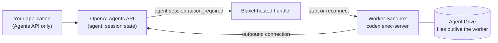

# Webhook-managed workers

Start with the [baseline and fresh-session handoff](../README.md). This optional guide deploys a controller so OpenAI can request a worker when a session needs a computer. It adds a saved agent, controller Sandbox, webhook registration, and workers; none are required for the baseline.

Complete the [cookbook credential setup](../README.md#run-it-yourself) first. Run every command below from the repository root.

`run.sh` and `run.sh --handoff` are application-managed: the script starts the Sandbox and the executor itself. The Agents API also supports **webhook-managed** sandboxes, where the application only creates sessions and sends input, and a handler deployed once in your Blaxel account starts or reconnects the Sandbox when OpenAI asks for one. The implementation is in [handler.py](handler.py).



## Deploy the handler

The controller creates workers on your behalf, so it needs a Blaxel API key rather than a `bl login` session.

```bash
export BL_WORKSPACE='<blaxel-workspace>'
export BL_API_KEY='<blaxel-api-key>'
./run.sh --deploy-webhook
```

The first deploy creates a saved OpenAI agent and persists its ID in `.runs/deployment-<prefix-or-default>.json`. Redeploy and reconnect reuse that identity; `OPENAI_AGENT_ID` can select an existing saved agent explicitly. It then starts the controller Sandbox `openai-agents-api-webhook-controller` in `us-was-1` and prints its public webhook URL. Register that URL in your OpenAI project under Settings, Webhooks, for `agent.session.action_required` and `agent.session.failed`, export the signing secret as `OPENAI_WEBHOOK_SECRET`, and run the deploy again. Until the secret is configured the endpoint answers `503`.

The Blaxel API key must be valid for the selected workspace. A working local `bl login` does not validate an exported `BL_API_KEY`. Use a durable API key for a long-lived controller; a temporary login token can expire while the controller is still running.

## Test a separate deployment

The default deployment reuses its controller and replaces the running process. To keep a review deployment separate, choose a unique prefix before its first deploy:

```bash
export OPENAI_WEBHOOK_RESOURCE_PREFIX='openai-review'
export OPENAI_AGENT_NAME='openai-review'
unset OPENAI_AGENT_ID OPENAI_WEBHOOK_SECRET
./run.sh --deploy-webhook
```

This creates `openai-review-controller` and names its workers `openai-review-worker-<session-hash>`. Register this deployment's URL and export its own signing secret before the second deploy. The deployment manifest preserves the new agent ID. Keep the same prefix for both deployment and `--reconnect`. Leave the prefix unset to preserve the original controller and worker names.

## Prove reconnection with files preserved

```bash
./run.sh --reconnect
```

The application sends work through the Agents API; the proof script also uses Blaxel to delete and inspect workers. It creates a session for the saved agent and sends a first turn; the handler starts a worker, mounts that session's Agent Drive, and the agent writes `note.md`. The script then stops the executor, deletes that worker, waits for OpenAI's `agent.session.environment.disconnected` event, and sends a second turn in the same session. OpenAI sends `agent.session.action_required` again, and the handler starts a replacement worker on the same Drive path. The run passes only when the replacement reads the marker the first worker wrote.

```text
created OpenAI session sess_...; the webhook handler owns worker openai-agents-api-worker-...
confirmed .../note.md on worker openai-agents-api-worker-...
deleted worker openai-agents-api-worker-...; OpenAI reported the environment disconnected after 5s; the session and its Agent Drive files remain
confirmed replacement worker openai-agents-api-worker-... read the file the first worker wrote
kept .../note.md and .../review.md on Agent Drive
verified deletion of OpenAI session sess_...
verified deletion of Blaxel sandbox openai-agents-api-...
```

## How the handler behaves

| Rule | Why |
| --- | --- |
| Wakes only on `agent.session.action_required` with `environment_connection`, after re-reading the session | `agent.session.turn.created` and `agent.session.in_progress` arrive too late, and `function_call` actions belong to the application |
| Never stops a worker on `idle` | `agent.session.idle` can fire before the waiting input starts its turn |
| One worker and a separate Drive per session, with matching access labels | A replacement reuses its session's files; unrelated sessions do not receive the same Drive access |
| Holds the worker awake with process keep-alive while the executor runs | A Blaxel microVM suspends within seconds of API inactivity, even in the middle of a command |
| Passes only `OPENAI_EXECUTOR_API_KEY` into workers | The project key and the signing secret stay on the controller |
| Deletes the worker when the session reaches `failed`; otherwise leaves deletion to you | Deleting a session sends no webhook, so your application must delete the worker too |
| Verifies every delivery, limits request bodies to 1 MiB and stores accepted work in SQLite before answering `200` | The queue survives controller restarts, and transient provisioning retries are bounded, exhausted jobs remain inspectable, and newer deliveries survive an in-flight reconciliation |
| Waits while a worker is still `DELETING` and treats a lingering `TERMINATED` record as absent | Blaxel deletes asynchronously, and creating over the terminated record yields a fresh Sandbox |

Release compute deliberately: stop the executor process before deleting a worker, and send the next input only after OpenAI emits `agent.session.environment.disconnected`. Input sent while OpenAI still believes the executor is connected runs without file access and does not trigger the wake webhook.

Workers live for `WORKER_TTL` (default `2h`) from creation; set it above your longest session. The controller Sandbox lives for `CONTROLLER_TTL` (default `24h`) from creation; redeploying its process does not renew that lifetime. Restarting its process keeps the SQLite queue; deleting or expiring the controller loses that local queue. When you are done, remove that deployment's OpenAI webhook, delete its controller and remaining workers, and delete its API sessions. Use the configured prefix to identify the deployment; preserve resources belonging to other deployments.

## Existing preview deployments

New deployments use a version 2 manifest with the original API endpoint and a controller allocation inventory. A version 1 manifest cannot prove that ownership, so automated inspect and teardown are disabled for it. Inspect the old deployment in its original workspace, keep its exact cleanup records, and choose a new `OPENAI_WEBHOOK_RESOURCE_PREFIX` for this version.

## Inspect and remove the deployment

Keep the same `OPENAI_WEBHOOK_RESOURCE_PREFIX` and inspect or tear down its recorded resources:

```bash
.venv/bin/python -m webhook.deploy --inspect
.venv/bin/python -m webhook.deploy --teardown
```

The deployment manifest binds recovery to the original Blaxel workspace and API endpoint. A target mismatch stops cleanup. The controller records each requested worker or Drive name before allocation, then confirms ownership from the result. Teardown stops provisioning and resolves interrupted allocations by exact name and deployment label. A known creation rejection is recorded as not allocated. If the request outcome is still uncertain, the controller does not resubmit it, and teardown reports incomplete and keeps the controller and inventory for a later retry. Reused resources and application-owned OpenAI sessions are preserved. Before removing the controller, teardown saves its final inventory locally so a later cleanup attempt can resume. If the controller expires before that inventory is captured, automatic teardown stops because ownership cannot be recovered safely.

Teardown retains Drives by default. Add `--delete-drives` only when you intend to remove the deployment's recorded owned Drives and their files.

OpenAI webhook registration is a separate dashboard resource. Export `OPENAI_WEBHOOK_ID` when deploying to record its identity. Teardown reports manual registration removal as pending until you remove that exact registration in the OpenAI dashboard and record your confirmation:

```bash
.venv/bin/python -m webhook.deploy --confirm-registration-removed
```

This command records your dashboard verification; it does not delete the registration through an API. Keep the signing secret in the environment, never in the manifest.

[Return to the cookbook](../README.md).
